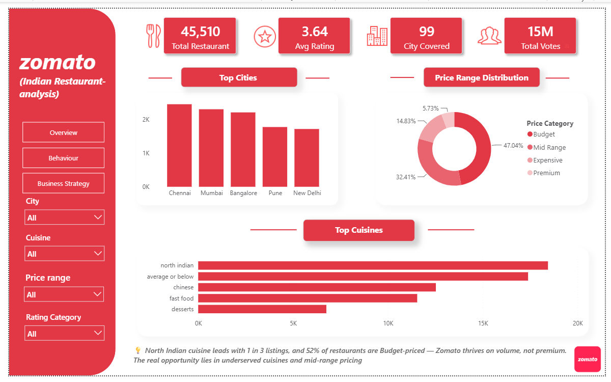
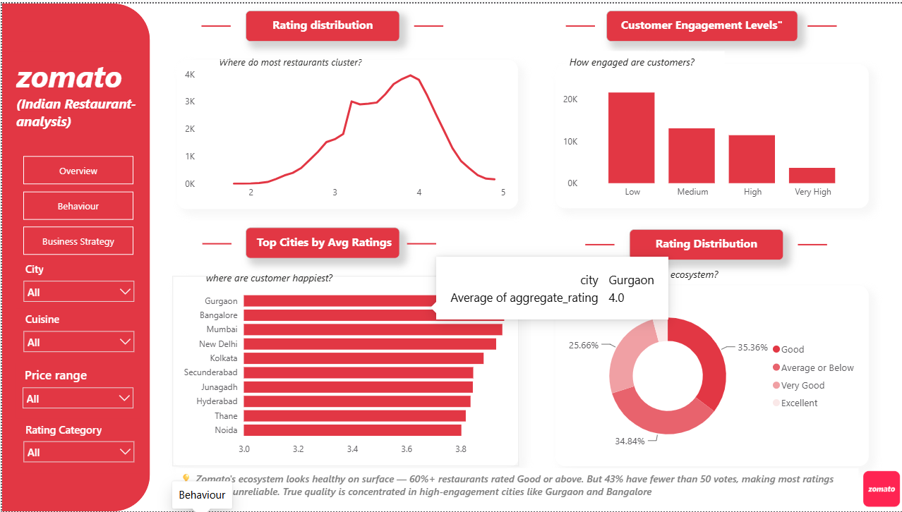
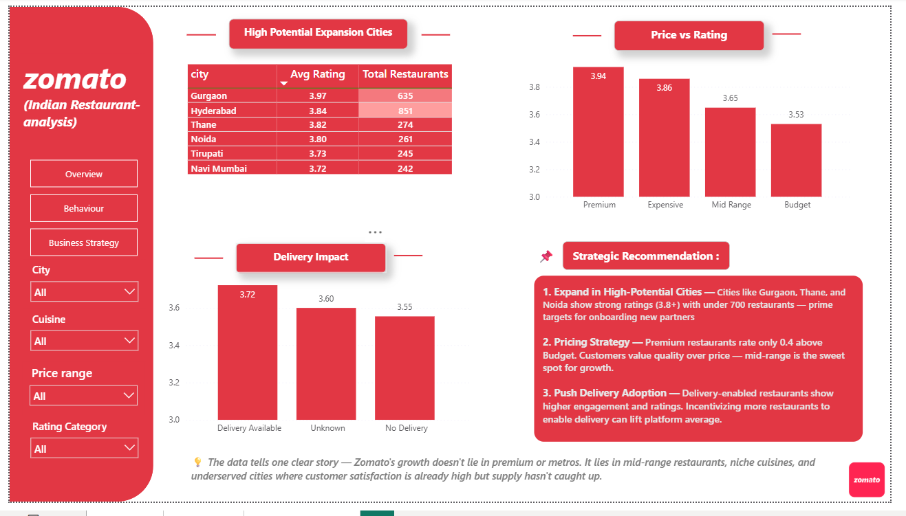

# 🍽️ Zomato Indian Restaurant Analysis

> **Exploratory Data Analysis + Interactive Power BI Dashboard**  
> Uncovering what drives restaurant success on Zomato across 99 Indian cities.

---

## 📌 Project Overview

This project analyzes **55,000+ Indian restaurants** listed on Zomato to understand customer behavior, rating trends, cuisine preferences, and city-wise performance — and translates those insights into a **3-page interactive Power BI dashboard** built for business decision-making.

The analysis answers real stakeholder questions:
- Where should Zomato expand next?
- Do higher prices guarantee better ratings?
- Which restaurants are actually trustworthy?
- What cuisines have the biggest growth opportunity?

---

## 💡 Key Insights

- 🍛 **North Indian cuisine dominates** with 1 in 3 listings — but 52% of restaurants are Budget-priced, proving Zomato thrives on volume, not premium.
- ⚠️ **43% of restaurants have fewer than 50 votes** — making their ratings statistically unreliable despite looking decent on surface.
- 📍 **Cities like Gurgaon, Thane & Noida** show 3.8+ avg ratings with under 700 restaurants — high satisfaction, low competition. Prime expansion targets.
- 💰 **Premium restaurants rate only 0.4 above Budget** — customers value quality over price. Mid-range is the real sweet spot.
- 🛵 **Delivery-enabled restaurants** average 0.17 higher ratings than non-delivery ones — customer convenience drives satisfaction.

---

## 📊 Dashboard Preview

### Page 1 — Executive Overview


### Page 2 — Customer Behavior & Trust


### Page 3 — Business Strategy


---

## 🛠️ Tools & Technologies

| Tool | Usage |
|------|-------|
| Python | Data cleaning, EDA |
| Pandas | Data manipulation |
| Matplotlib & Seaborn | Data visualization |
| Power BI | Interactive dashboard |
| DAX | Custom measures & KPIs |
| Power Query | Data transformation |

---

## 📁 Project Structure

```
ZOMATO-ANALYSIS-INDIAN-RESTAURANT/
│
├── zomato_project.ipynb        ← EDA Notebook
├── Indian-Resturants.csv       ← Raw dataset
├── cleaned_data.csv            ← Cleaned dataset
├── zomato_analysis.pdf         ← EDA Report (Canva)
│
└── dashboard/
    ├── zomato_dashboard.pbix   ← Power BI Dashboard
    ├── dashboard_page1.png     ← Overview screenshot
    ├── dashboard_page2.png     ← Behavior screenshot
    ├── dashboard_page3.png     ← Strategy screenshot
    └── dashboard_demo.mp4      ← Dashboard demo video
```

---

## 📈 EDA Steps Covered

1. Importing Libraries
2. Loading & Inspecting Dataset
3. Data Cleaning (dropped irrelevant columns)
4. Statistical Summary
5. Rating Distribution Analysis
6. City-wise Restaurant & Rating Analysis
7. Cuisine Popularity Analysis
8. Price Range vs Rating Analysis
9. Votes vs Rating Correlation
10. Business Insights & Recommendations

---

## 🔍 Dataset Info

- **Source:** Zomato API (Kaggle)
- **Rows:** 60,077 restaurants
- **Cities:** 99 Indian cities
- **Key columns:** `name`, `city`, `cuisines`, `aggregate_rating`, `votes`, `price_range`, `delivery`

---

## 👤 Author

**Mayank Bhardwaj**  
Aspiring Data Analyst | BCA 2026 | Manipal University Jaipur  

[][(https://github.com/mynkbhardwaj87007-spec](https://github.com/mynkbhardwaj87007-spec/ZOMATO-ANALYSIS-INDIAN-RESTAURANT))  
[]([https://www.linkedin.com/in/YOUR-LINKEDIN-URL](https://www.linkedin.com/in/mayank-bhardwaj-87b36835b/))

---

*⭐ If you found this project helpful, consider giving it a star!*
